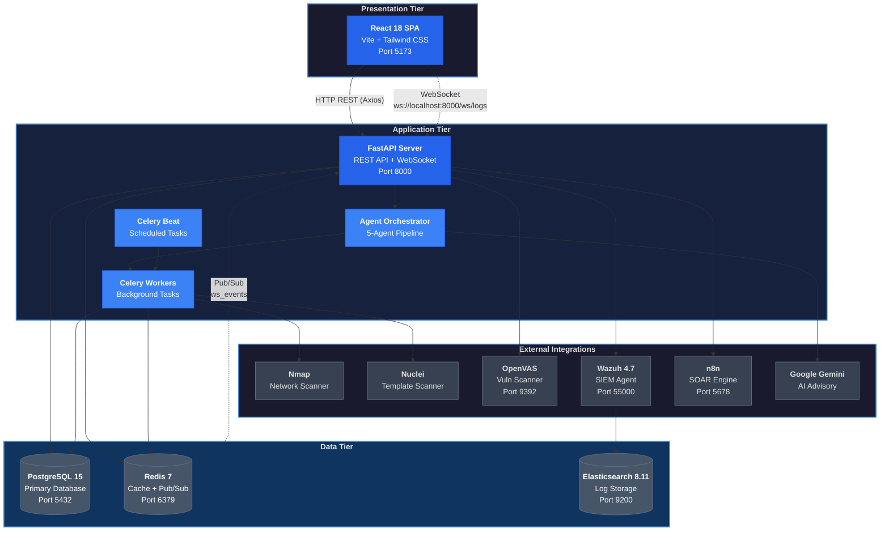
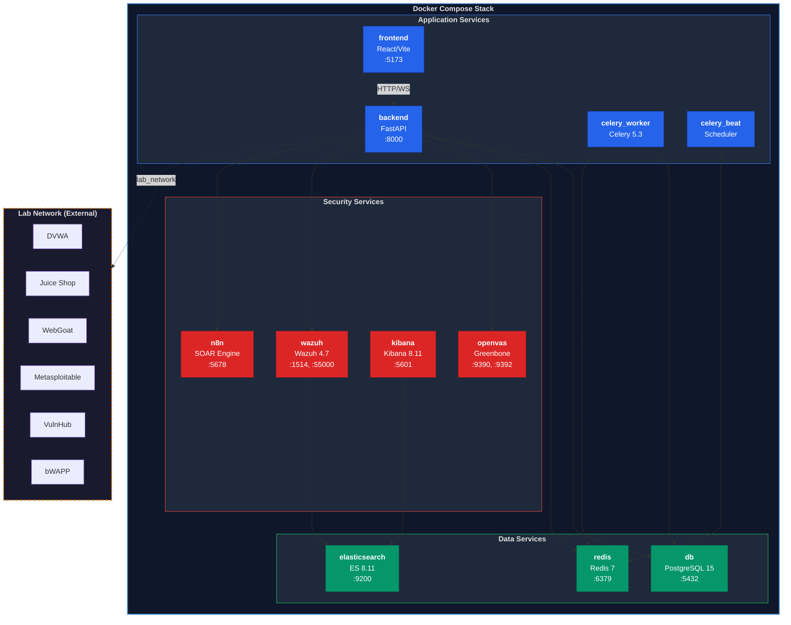

# (Found 404 System Architecture)

This file provides a comprehensive overview of the Found 404 platform's technical architecture, covering everything from the high-level data flow to the intricate specifications of the deployment environment.

## High-Level System Architecture:

### Figure 3.1
 *High-Level System Architecture Diagram — Three-tier client-server architecture showing the React presentation tier, FastAPI application tier with agent orchestration and Celery workers, data tier (PostgreSQL, Redis, Elasticsearch), and external integrations (Nmap, Nuclei, OpenVAS, Wazuh, n8n, Google Gemini). All services are orchestrated via Docker Compose.*

## Docker & Deployment Architecture

### Figure 3.8:
*Docker Compose Service Architecture — Eleven containerized microservices organized into three layers: Application (FastAPI, React, Celery Worker, Celery Beat), Data (PostgreSQL, Redis, Elasticsearch), and Security (OpenVAS, Wazuh, Kibana, n8n). An external lab_network bridges the stack to six vulnerable target containers for testing.*

