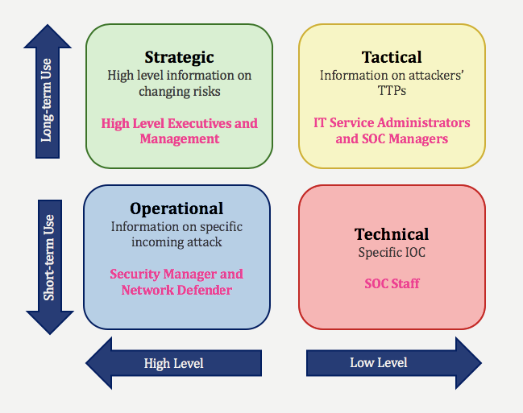
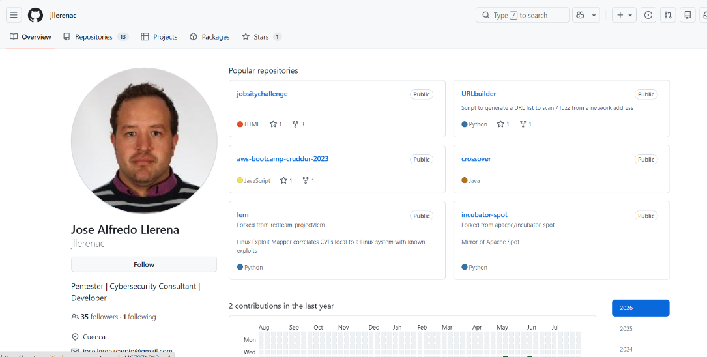
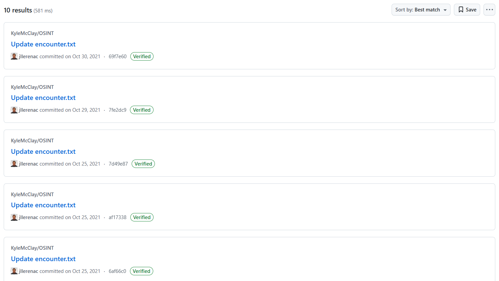
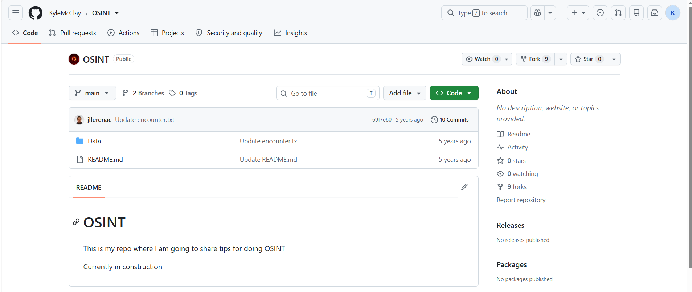
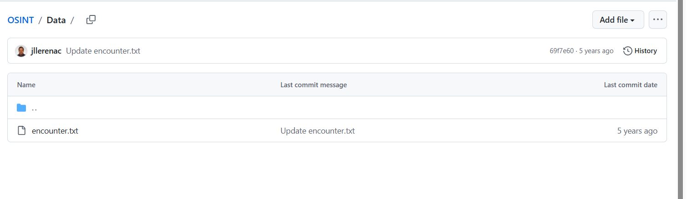
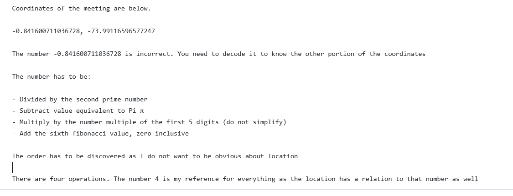
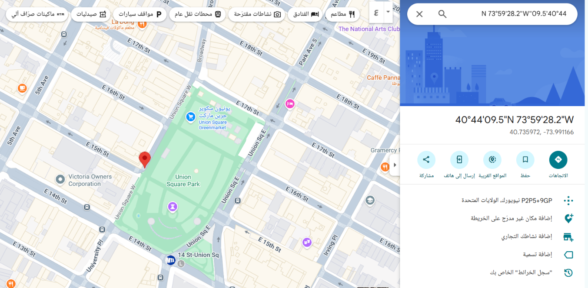

# article\_en

Cyber Threat Intelligence (CTI) is one of the most important fields in Cybersecurity. It aims to collect data from multiple sources and analyze it in order to produce **Actionable Intelligence** that helps organizations prevent Cyber Attacks and reduce damage.

The CTI field focuses mainly on understanding the **Tactics, Techniques, and Procedures (TTPs)** used by attackers, and on turning Raw Data and IOCs into useful Information that is tailored to each organization based on the nature of its business and the threats targeting it.

## CTI Lifecycle

### Planning and Direction

The **Planning and Direction** phase is the foundation for the success of the entire Intelligence cycle. In this phase, the objectives are defined, along with who the end consumer of the report is, and which entities or teams will make decisions based on it.

The planning phase includes answering key questions to define the **Scope** of the Intelligence:

* **Existence of a SOC team**: This determines whether the Intelligence will be technical and detailed for SOC Analysts, or high-level summaries aimed at Managers.
* **History of previous attacks**: Helps determine the consumption rate of Intelligence and the frequency of pulling data from Internal and External Sources.
* **Nature of the targets**: If the organization itself is being targeted, the focus is on External Attack Surface Management. If individuals are being targeted, the focus is on Digital Risk Protection to protect Credentials and against Phishing Risks.
* **Sector-based threats**: Coordinating with companies in the same industry to benefit from Industry-based Intelligence and share IOCs to counter shared attacks.

### Information Gathering

The information-gathering phase relies on multiple internal and external sources to get the latest threats:

* Hacker Forums, the Dark Web, and Bot Markets.
* Ransomware Blogs and Cybersecurity Blogs.
* Public Sandboxes and Public Research Reports.
* Channels like Telegram, Discord, ICQ, and social media such as Twitter, LinkedIn, and Facebook.
* Code and file repositories such as GitHub, GitLab, and Bitbucket.
* Exposed public storage such as Amazon S3 and Azure Blob Buckets.
* Specialized search engines such as Shodan, BinaryEdge, and ZoomEye.
* IOC databases such as AlienVault OTX, Abuse.ch, and MalwareBazaar.
* Honeypot systems and Internal Security devices such as SIEM, IDS/IPS, and Firewalls.

### Processing

The **Processing** phase acts as a main filter, where data is cleaned of False Positives, and Rulesets and Correlation are applied to produce organized data ready for analysis.

### Analysis and Production

The **Analysis** phase relies on interpreting the data and turning it into Actionable CTI, then preparing reports in the format appropriate for the target audience, whether technical or managerial.

### Dissemination and Feedback

The **Dissemination** phase involves distributing the Intelligence to relevant parties through the appropriate channels, while activating the Feedback loop to continuously improve the process and avoid mistakes — such as evaluating Subdomains separately from the Root Domain to reduce False Positives.

## Types of Cyber Threat Intelligence

The types of CTI differ based on the job level and the specific needs of each team within the organization:

### Technical Cyber Threat Intelligence

This type is the output of technical analysis, which relies mainly on IOCs.

Its importance lies in helping the organization build rulesets to protect against attacks, through reports that contain hashes of malicious IP addresses, phishing domains, and malicious files.

As shown in the image, this type is classified as **Low Level** and **Short-term Use**, because it focuses on a Specific IOC.

The team that relies on this type is the SOC Staff and Incident Responder.

### Tactical Cyber Threat Intelligence

This type focuses on understanding the TTPs (Tactics, Techniques, Procedures) of attackers.

It aims to answer important questions such as: What vulnerabilities does the attacker exploit? Which countries does the attacker operate from? What are the attacker's motivations and methods? This helps in taking preventive measures.

This type is considered **Low Level** but intended for **Long-term Use**.

The team that relies on this type is the IT Service Administrators and SOC Managers who are responsible for leading technical teams.

### Operational Cyber Threat Intelligence

There is a lot of confusion between this type and Tactical CTI because both are concerned with TTPs, but this type is used mainly in Threat Hunting operations.

This type is distinguished by its narrower scope, as it can focus on a specific type of attack or a specific attacker, unlike Tactical CTI which is more automated.

This type is considered **High Level** and **Short-term Use**, because it provides information about a specific incoming attack.

The team that relies on this type is the Security Manager, Network Defender, and Threat Hunting personnel.

### Strategic Cyber Threat Intelligence

This type is designed specifically for top executives within the organization.

It is very useful for long-term tasks such as product purchasing, budgeting, and planning, and this is done by evaluating the outputs of Tactical CTI.

This type is classified as **High Level** and **Long-term Use** because it provides important information about changing risks.

The team that relies on this type is the High Level Executives and Management.

## Determining the Attack Surface

### The Importance of Attack Surface in Threat Intelligence

Classical CTI models on their own are no longer sufficient. A new concept called **External Attack Surface** emerged to fill this gap. From here came the concept of **Extended Threat Intelligence (XTI)**, which differs from regular CTI in that it builds an attack surface specific to the organization itself in order to produce intelligence tailored to it, not just general information about threats.

The main benefit of building the attack surface is that the organization gains **visibility** over all its assets — whether it's a forgotten endpoint or an old subdomain nobody remembers. The ultimate goal: the organization knows everything precisely, and knows exactly which assets it should defend, because you can't protect something you don't even know exists.

### Determining the Attack Surface

When defining the Attack Surface, it includes an integrated set of elements: Domains, Subdomains, Websites, Login Pages, CMS systems and Technologies Used on Websites, IP Addresses, IP Blocks and DNS Records, C-Level Employee Mails, Network Applications and Operating Systems, Bin Numbers and Swift Codes belonging to banks, and finally SSL Certificates.

#### Domains

The only piece of information available at the start is the main domain, and the CTI analyst's job is to build the entity's full structure starting from it. There are 3 main methods for finding additional domains belonging to the organization.

**Method 1: host.io Tool**

The host.io tool provides four different perspectives on the domain being investigated:

* **Co-Hosted**: Shows all domains hosted on the same IP address as example.com.
* **Backlinks**: Shows domains that have a link pointing to example.com.
* **Links to**: Shows domains that example.com itself links to.
* **Redirects**: Shows domains that automatically redirect to example.com once opened.

**Method 2: Reverse Whois**

When checking the whois data of example.com, we notice that the Registrant Organization field contains the company's own name, 'EXAMPLECORP'. This name can be used as a search key: using the viewdns.info tool, we perform what's called a Reverse Whois, which searches for all domains registered under the same organization name or the same Registrant Mail. This can return hundreds of domains, which are considered candidates for belonging to the company, and after verifying each one, it's added to the inventory.

As an alternative tool, whoxy.com can be used, which follows the same Reverse Whois principle but divides the results into four different search categories.

**Method 3: DNS Records Inspection**

By checking the DNS records of the main domain — whether through the `dig` command line or an online tool like dnslytics.com — we get information about the Name Servers (NS) and Mail servers (MX Records). The main idea here is that any shared nameserver belonging to a general hosting company might host thousands of unrelated domains, but if the nameserver is exclusively owned by the organization itself, then all domains hosted on it become strong candidates for ownership.

You'll notice that the nameserver ns2.example.com hosts 98 other domains. Doing a reverse lookup on the same nameserver using the same tool revealed domains like otherbank1.es and realestate-portal.es, all sharing the same NS Records and Mail Servers, which is a strong indicator that they all belong to the same organization's infrastructure. After verification, they can be added to the inventory.

#### Subdomains

After collecting the main domains, the next step is discovering the subdomains of each domain. There are four main tools you can use for this:

* **SecurityTrails**: Can be used from the command line via the `hacktrails` tool, via the API, or directly from the web interface. Produces high-quality results.
* **Sublist3r**: A command-line tool that gathers results from multiple sources simultaneously, such as Baidu, Yahoo, Google, Bing, Netcraft, DNSdumpster, VirusTotal, ThreatCrowd, SSL certificates, and PassiveDNS. The tool can successfully find hundreds of unique subdomains.
* **Assetfinder**: Another tool that queries multiple sources to find subdomains.

#### Websites

After compiling a large list of domains and subdomains, this doesn't mean each one represents a live website. To confirm this, HTTP/HTTPS requests must be sent to every item in the list to see which ones actually respond. The `httpx` tool does exactly this job — it scans the entire list and returns only the links that responded, such as http://calendar.example.com, https://drag.example.com, and https://admon.lb.example.com. As an alternative to httpx, the `httprobe` tool can be used, which performs the same function.

#### Login Pages

Discovering which sites in the list actually contain a login page is a harder challenge than just checking availability, because it requires understanding the page's content, not just whether it's reachable. Manually going through each site to classify it takes a lot of time and effort, so it's recommended to write a simple Python script using the `requests` and `BeautifulSoup` libraries, which sends a request to each site and analyzes the response content to answer inferential questions such as: Does the word "Login" or its equivalent in any language appear on the page? Are there form tags? Are there words like "Username" or "Password" as placeholders?

#### Technologies Used on Websites

These are the methods and techniques used to detect the infrastructure and systems that websites run on.

First, we use **Browser Extensions** like Wappalyzer, Whatruns, and BuiltWith. These are tools installed on the browser to perform analysis and produce detailed information about the technologies used, such as the CMS, databases, web servers, and JavaScript frameworks.

Second, we have **Online Scanning Tools** like whatcms.org, which is a quick method that doesn't require installing any software — you just enter the URL and the tool displays basic information such as the programming language and web server on a single results page.

Third, we do **Manual Inspection** of the source code, a manual method where you view the code and look for the file paths and directories of the CMS, or the themes and libraries inside script tags.

Fourth, we do **Response Headers Analysis** using the browser's Developer Console to inspect the response headers returned from the server, which often leak direct information about the hosting environment, such as the Server header and the X-Powered-By header, which reveal the web server and backend programming language.

#### IP Addresses

IP addresses are among the most important assets of an organization by far. Serious risks arise when the open ports on these addresses aren't monitored regularly, or when outdated services continue running on these ports without updates. That's why monitoring these ports and services and detecting their associated risks in a timely manner is vital for the security of any network.

A list of IP addresses can be built by analyzing the domains and subdomains collected previously, either by collecting their A records, or by sending a request and analyzing the resulting resolve process. Additionally, to discover all active IP addresses within blocks belonging to the organization, requests can be sent to every address in the range and only the active ones selected.

#### IP Blocks

IP blocks often contain addresses actually owned by the organization, which makes them one of the highest-risk assets, and monitoring them is extremely important. These ranges can be discovered by noticing recurring patterns in the IP addresses that appeared from the domains, and checking the whois data for consecutive addresses to confirm their actual ownership by the organization.

As a secondary method, you can search using a special search parameter called `org` on the Shodan search engine. For example, searching `org:"Example Corp"` shows all IP addresses whose organization field contains the word "Example Corp." This can return hundreds of results.

#### DNS Records

Continuously monitoring DNS records is very important for detecting any unknown or unauthorized changes, which could indicate suspicious activity or a potential breach. Google's online dig tool can be used, or sites like dnslytics.com, or simply the `dig` command from the command line.

#### Network Applications and Operating Systems

One of the most important steps for tracking vulnerabilities, whether actively or passively, is compiling a full inventory of all applications and operating systems within the organization. All the methods mentioned previously in the IP address section apply here as well. Additionally, discovered services can be collected by querying the organization's IP addresses through the Shodan tool, or they can be detected via active scanning. Detection of Network applications and the operating system can be done based on the responses to the requests we sent to the open ports of the IP addresses that were previously identified in our asset list.

#### Bin Numbers and Swift Codes

Bin numbers and Swift codes are among the most important assets to monitor specifically in the banking sector, especially regarding the detection of stolen credit cards — something that directly matters to fraud teams within banks. Specialized public databases are used to discover the Bin numbers belonging to a specific organization, the most famous being bincheck.io, freebinchecker.com, and bintable.com, where results can be filtered by country and bank name to get a list of Bin numbers belonging to it.

As for Swift codes, there are specialized sites like wise.com, bank.codes, and theswiftcodes.com, where you can look up the Swift code of any bank by its name. For example, you might find the code for "EXAMPLE CORP BANKING" is EXCPUS33, along with additional details such as the bank's address, city, and country.

#### SSL Certificates

SSL certificates are among the most important factors for securing the connection between a user and a website, so it's important to carefully verify the existence of a valid certificate on every discovered domain and add it to the asset list. These certificates can be collected manually, but since this process takes a lot of time, it's preferable to use specialized tools to speed it up, the most famous being Censys and crt.sh. Both tools allow searching for all issued certificates that contain the target domain name, example.com, showing details such as the Issuer and the issue/expiry dates.

## Gathering Threat Intelligence

One of the most important things when gathering data about cyber threats is to search many sources — not just a few — and try to search extensively.

### Shodan

Shodan is a web-based search engine, and one of the most well-known search engines of its kind. It allows users to search for internet-connected systems using specific search filters. Searches can be performed for a specific organization or even an entire country, worldwide.

Shodan is distinguished by a very flexible structure that can be shaped in any direction the researcher wants. For example, it can be used to reveal all systems belonging to a specific country or organization where port 21 (FTP) is open and accessible on the internet. A lot of data can be accessed immediately through the direct search interface on the website, but sometimes it's necessary to pull data via Shodan's API, especially since manually gathering intelligence through the interface alone isn't practical at scale. Shodan provides full documentation for its API explaining how to retrieve data programmatically.

### Resources Providing IOCs

Collecting IP addresses, domains, hashes, and C2s belonging to threats is one of the most important ways to protect against potential attacks. Gathering the artifacts belonging to threat actors allows for the discovery of these malicious entities.

#### Hacker Forums

Hacker Forums are one of the most important places for gathering intelligence. Threat actors usually participate in forums while preparing for an attack. By analyzing their activity in these forums, you can find answers to critically important questions such as the direction of the attack, the specific targets, the methods that will be used in the attack, and even identifying who's behind the attack.

#### Ransomware Blogs

Ransomware Blogs are among the sources that gained significant popularity starting with the COVID-19 pandemic. Ransomware groups began publishing the data of victims who refused to pay on these blogs.

These blogs answer questions such as: who is being targeted, and what are the motives?

Among the most well-known Ransomware groups are Lockbit, Conti, Revil, Hive, and Babuk. To access Ransomware group blogs, the Tor browser needs to be installed first, because the links to these blogs are usually `.onion` extensions, which are not accessible through a normal browser.

#### Black Markets

Black Markets are where credit cards, stealer logs, and RDP access are sold.

The data gathered from here on its own has limited value and won't produce actionable output by itself. But if a full attack surface has been built, and the data collected here matches any data present in our attack surface, then it produces an actionable result.

#### Chatters

Communication platforms or "Chatters" of various types (text, voice, or video) are a very important source in Threat Intelligence, because threat actors rely on them to exchange sensitive data or to plan and prepare attacks. Therefore, continuous monitoring of apps like Telegram, ICQ, IRC, and Discord is essential.

#### Code Repositories

Code Repositories like GitHub, GitLab, and Bitbucket are environments full of forgotten sensitive data, because individuals or companies often forget important information such as database login info, Configuration files, and API keys.

#### File Share Websites

File Share Websites are heavily used by attackers to share files.

Sometimes confidential documents belonging to companies or countries get leaked on these sites after a breach occurs.

Monitoring these sites is a very important step in Threat Intelligence in order to detect any leak as fast as possible.

The most well-known sites that allow anonymous file uploads are Anonfiles, Mediafire, Uploadfiles, WeTransfer, and File.io.

There are two ways to extract data from these sites:



### Guessing the unique keys of files

Sending them to the application's server — an expensive method that requires significant processing power.



### Using Dorks

Using Dorks through a script to pull files that browsers have indexed — an easier method with very low cost.



#### Public Buckets

Cloud-based applications like Buckets are used by companies and individuals to store data, and they're supposed to be locked down to authorized users only.

Unfortunately, these environments are often left open to the public, which causes exposure of confidential and sensitive data, making them an important source for Threat Intelligence.

#### Honeypots

Honeypot systems are one of the most effective methods for trapping attackers.

The idea behind them is that they are systems full of security vulnerabilities and not connected to any sensitive server, so they act as a trap that attracts attackers.

What's useful for Threat Intelligence is collecting the IOCs, such as their IP addresses, and using them to protect our real systems.

## &#x20;Using Threat Intelligence

After the data is interpreted relative to the attack surface, it turns into ready-to-use threat intelligence. This intelligence can be used in 3 main areas:

* External Attack Surface Management (EASM)
* Digital Risk Protection (DRP)
* Cyber Threat Intelligence (CTI)

### External Attack Surface Management (EASM)

EASM is part of XTI, and its job is managing the organization's outward-facing assets. The attack surface we build is the foundation of EASM, and this section talks about how we monitor these assets and how they're fed by the intelligence we gather.

Continuous monitoring of assets is important to detect unknown/forgotten assets, such as a new domain being added or an old domain that's stopped being used being removed from the asset list. Any security vulnerability on these assets poses a risk to the organization.

**EASM Alerts & Actions Table**

| Alert                              | Meaning                                                                               | Action                                                                                                                                                 |
| ---------------------------------- | ------------------------------------------------------------------------------------- | ------------------------------------------------------------------------------------------------------------------------------------------------------ |
| New Digital Asset(s) Detected      | A new asset (domain/subdomain) has been added to the monitoring list                  | Confirm the asset actually belongs to the company and was created by an authorized user                                                                |
| Domain Information Change Detected | A change in the whois data of an existing domain in the asset list                    | Compare the old data with the new and confirm the change came from an authorized party                                                                 |
| DNS Information Change Detected    | A change in the DNS records of an existing domain                                     | Compare the old records with the new and confirm there's no suspicious activity                                                                        |
| DNS Zone Transfer Detected         | A change in the DNS Zone Transfer status of one of your domains                       | Review the DNS records and confirm whether a zone transfer actually happened                                                                           |
| Internal IP Address Detected       | An internal IP appeared in the A record of a domain/subdomain instead of a public one | Contact the DNS admin, investigate the cause, and change the IP if it's not intentional                                                                |
| Critical Open Port Detected        | A critical port appears open on a monitored IP (source e.g. Shodan)                   | Verify the port, close it or filter it if not actually in use, or update the service if it is in use                                                   |
| SMTP Open Relay Detected           | Your mail server is running with open relay                                           | Check the mail server status by contacting the person responsible                                                                                      |
| SPF/DMARC Record Not Found         | A domain in the asset list is missing an SPF or DMARC record                          | Contact the mail server admin to configure these records correctly                                                                                     |
| SSL Certificate Revoked/Expired    | An SSL certificate for one of the domains has expired or been revoked                 | Renew the certificate quickly, since its absence means unencrypted transmission                                                                        |
| Suspicious Website Redirection     | One of your domains is redirecting to a site not in the asset list                    | Check the redirection immediately and report it to the responsible team, as it could indicate a compromise                                             |
| Subdomain Takeover Detected        | Someone managed to take control of a subdomain belonging to you                       | Identify the DNS record where the takeover occurred and report it to the responsible team immediately                                                  |
| Website Status Code Changed        | The status code returned by the site has changed                                      | Determine the root cause and apply a fix quickly to avoid service downtime                                                                             |
| Vulnerability Detected             | A match found between a vulnerability and your assets (apps, SSL, IPs...)             | If the source is a CVE with product/version details, accuracy is high — apply the fix immediately. If the source is Shodan, accuracy is somewhat lower |

### Digital Risk Protection (DRP)

DRP represents the largest portion of an organization's intelligence, after all the data collected from every source has been mapped onto the attack surface following interpretation.

Topics covered by DRP include: brand reputation protection, Deep & Dark Web threats, fraud protection for banks, supply chain risk impact, web surface threats, and VIP (senior executive) protection.

**DRP Alerts & Actions Table**

| Alert                                                             | Meaning                                                                                      | Action                                                                                                                                                                         |
| ----------------------------------------------------------------- | -------------------------------------------------------------------------------------------- | ------------------------------------------------------------------------------------------------------------------------------------------------------------------------------ |
| Potential Phishing Domain Detected                                | A new domain similar to yours appeared (from a new registration or new SSL certificate)      | Inspect the domain in a safe environment; if it's mimicking your content, contact the registrar and ISP to take it down immediately                                            |
| Rogue Mobile Application Detected                                 | A fake version of your official app appeared on pirated APK sites                            | Analyze the APK in a safe environment; if malicious, take swift removal action                                                                                                 |
| IP Address Reputation                                             | Your IP got blacklisted, or appeared in a malicious feed or torrent activity                 | If blacklisted, check the cause and remove it. If it appeared in an IOC feed or torrent, this is more serious as it could indicate a breach — immediate investigation required |
| Impersonating Social Media Account Detected                       | A social media account impersonating your company's name                                     | Review the account; if it's being used for fraud or a smear campaign, contact the platform to shut it down                                                                     |
| Botnet Detected at Black Market                                   | A device belonging to your domain/IP appeared in botnet data on black markets                | If it's a customer's device, force a password reset. If it's an employee's device, isolate it from the network immediately and conduct a forensic investigation                |
| Suspicious Content Detected at Deep & Dark Web                    | A post on a forum or dark market mentions your company                                       | Analyze the content properly and take the appropriate action before the attack happens or escalates                                                                            |
| Suspicious Content Detected at IM Platforms                       | Mention of your company in conversations on Telegram, ICQ, or IRC                            | Analyze the conversation and determine its context; if there's a real threat, act quickly                                                                                      |
| Stolen Credit Card Detected                                       | A stolen bank card number matched data from a bank within the intelligence                   | Report to the fraud team immediately so they can cancel the card                                                                                                               |
| Data Leak Detected on Code Repository                             | Sensitive data (IP, domain, database login info) found somewhere like GitHub or an S3 bucket | If the repo is yours, delete the data immediately; if not, request a takedown                                                                                                  |
| Company Related Information Detected on Malware Analysis Services | A malicious file referencing your company appeared in a public sandbox                       | Analyze the file and determine whether it's targeting you directly or is being used for a smear campaign, then take the necessary action                                       |
| Employee and VIP Credential Detected                              | Leaked login credentials for an employee or VIP you're monitoring                            | Apply an immediate password reset for the affected users                                                                                                                       |

### Cyber Threat Intelligence (CTI)

CTI is considered part of XTI, and it represents the new generation of threat intelligence. Through it, we can track what's happening in the cyber world in general: current malicious campaigns, ransomware group trends, or offensive IP addresses around the world.

Since relying on CTI alone can be difficult for protecting an organization, it must be supported with corporate feeds in order to reach the best possible intelligence. When we integrate CTI feeds with tools like SIEM, SOAR, and EDR, we can protect the organization much more effectively.

## LAB TIME

Now let's solve a lab on **BTLO**.

Here's the scenario and the information we have at the start:

> Authorities are looking for a hacker who is planning to sell a powerful device, and the delivery is going to be at an undisclosed but crowded location. It is important to find out what the product is and obtain more information about this hacker.
>
> **Product:** WiFi hacking device\
> **Key word for finding the exact name of product:** It is related to a fruit
>
> **Info known about the hacker:**\
> **Profile name:** jllerenac\
> **Additional Info:** He is known for being a good hacker and also a good developer. He has the location info stored somewhere.



### What is the name of the WiFi hacking device?

Based on the information we have, the device's name is related to a fruit, so we do a Google search to find out.

As is clear here, the name of the hacking device is the **WiFi Pineapple**.



### What is the name of the website containing the information of delivery location?

Now we need to find out which website contains information about the delivery location.

Based on the information we have — that the hacker's name is **jllerenac** — we do a Google search for him.

After searching, we found several accounts for him on Twitter, GitHub, and LinkedIn.

We started with his GitHub account.

We started looking through his repos for anything related to selling the WiFi Pineapple.

At first we didn't find anything useful, so we started looking through his pull requests and commits.

Here we found that he had made commits in a repo that isn't his own.

We opened the repo shown in the image and found only a single folder.

We opened the folder and found only a single file.

We opened the file and found coordinates in it, but they needed to be decoded.

So, the website containing the delivery location information is **GitHub**.



### What is the name of the file containing the information of location?

As we saw in the previous steps, we reached the coordinates from a repo that doesn't belong to the hacker directly. Now we need to know the name of the file — as shown clearly in the images, it's **encounter.txt**.



### Enter the coordinates of the meeting

Now we need to get the correct coordinates for the delivery after decoding the coordinates found in the file.

These were the coordinates:

**40.735971558530885, -73.99116596577247**



### Where is the delivery going to be?



