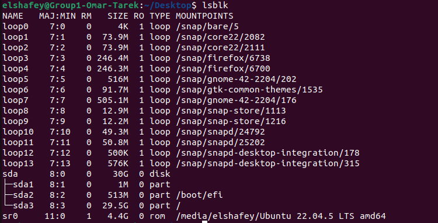
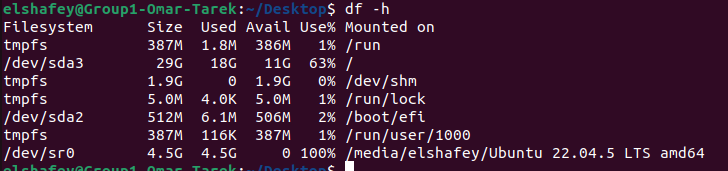
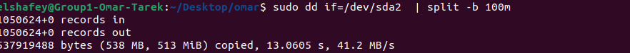
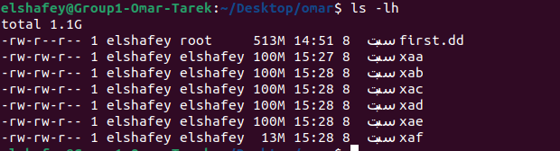
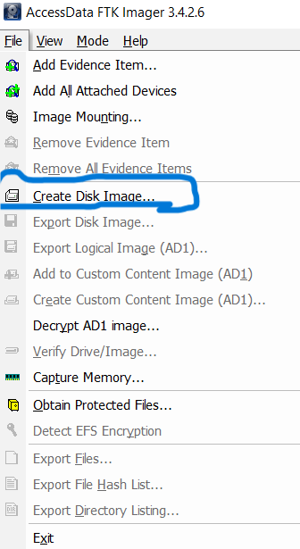
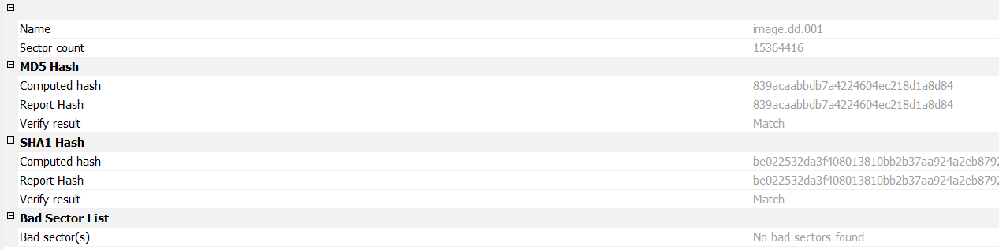
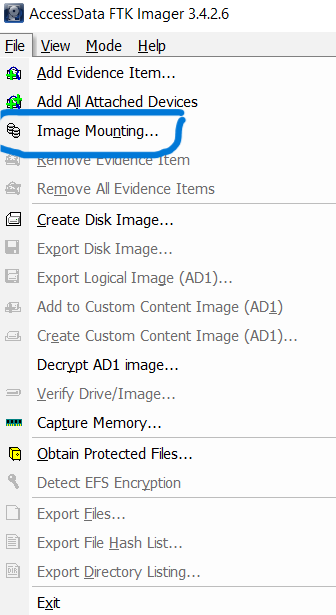
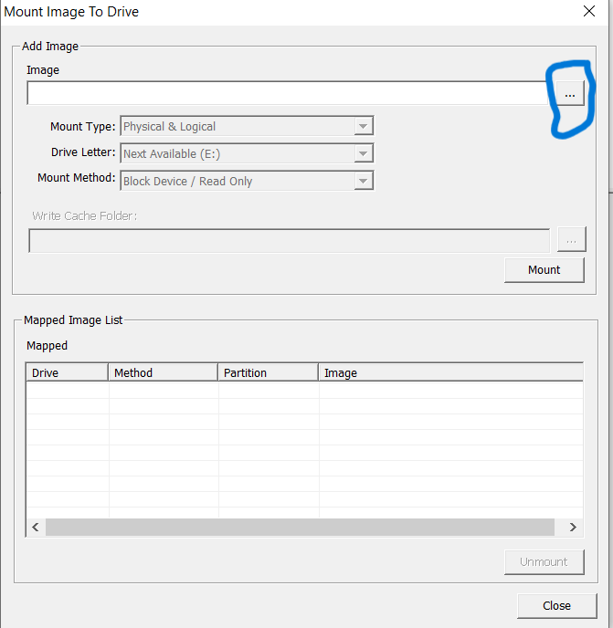

# CH 4

## Acquisition process

### Why We Do Acquisition

ليه ماينفعش نشتغل على الـ Artifact  علي طول\
أول حاجة، لو اشتغلت على  الجهاز الأصلي، أي Tool هتشغلها سواء Portable أو لأ هتسيب أثر في الـ Memory وبالتالي البيانات الأصلية هتتغير. عشان كده لازم نعمل Acquisition ونشتغل بعيد عن المكنة الأصلية.

كمان في  Forensics  أهم ركن فيه هو  (Hypothesis). كل محاولة Analysis بتأثر على الـ Evidence، وده سبب إضافي ليه ماينفعش نشتغل على الأصل.

كمان في الـ Business Context، مفيش مؤسسة هتديك السيرفر الأساسي تقعد تشتغل عليه 5 أيام وتوقف البزنس. اللي بيحصل إنك بتاخد Image وتكمل شغلك في المعمل&#x20;

وأخيرًا، الـ Acquisition بيسمحلك تعمل أكثر من نسخة (Cloning) من نفس المصدر. النسخة الأصلية تتخزن بدون مساس، وانت تشتغل على نسخة تانية.

***

## Most Important Task for Acquisition

أول خطوة إننا نحدد الـ Acquisition Point:

* عايز أعمل Acquisition لإيه؟
* إيه الـ Tool المناسبة؟

Preservation

بعد ما نسحب الـ Artifacts لازم نطمن إنها ما اتلعبش فيها.\
أبسط طريقة: Hash Calculation.\
ناخد Hash للـ Image أو الملف اللي اتسحب، وزميلك في المعمل يعمل نفس الحساب ويقارن القيم. لو متطابقة يبقى مفيش تغيير.

***

## Order of Volatility

الـ Acquisition بيتم حسب مبدأ مهم اسمه **Order of Volatility**، والمبدأ العام: "ابدأ بالحاجة اللي بتضيع بسرعة، وانتهي بالحاجة الأكثر ثبات".

الترتيب بيكون كالآتي:

1. CPU Registers
2. CPU Caches
3. RAM
4. Hard Disk
5. External Storage


## Types of Acquisition

### Live Acquisition

الـ Live Acquisition لازم يحصل في وقت محدد وغالبًا في موقع الجريمة، عشان كده اسمه "لايف".\
الـ Live Acquisition للحاجات اللي فيها Volatility يعني ممكن تضيع بسرعة، زي الميموري.\
مثال: لو البي سي أو اللاب توب اللي حصل منه الـ Breach اتساب شغال ساعتين أو اتقفل، الميموري كلها هتتفور، والرام كمان هتروح.\
عشان كده لازم أعمل Live Acquisition قبل ما أقفل الجهاز أو أفصل الكهرباء.

### Static Acquisition

الـ Static Acquisition هو اللي ممكن يحصل في أي وقت.\
أكبر مثال: الهارد ديسك.\
الجهاز اتقفل أو اتفصلت الكهرباء؟ البيانات المكتوبة على الديسك هتفضل موجودة.\
ومن هنا في نوع خاص من الـ Static Acquisition بنسميه **Dead Acquisition**، وده معناه إني مش محتاج الأوبريتنج سيستم خالص.\
مثال: حد جابلي هارد ديسك، أخدت منه Full Clone (Bit-wise Copy) من غير ما أتعامل مع الجهاز أو الأوبريتنج سيستم اللي عليه.

هوضح كل حاجه عن الصوره دلوقتي

<figure><figcaption></figcaption></figure>

## Disk Acquisition&#x20;

### Full Acquisition

معناها باخد الـ Component كامل زي ما هو.

* لو عندي 16GB RAM → هاخد الـ 16GB كاملين.
* لو عندي Hard Disk 1TB → هاخد الـ 1TB بالكامل.

#### &#x20;  Disk to Image

إن الهارد يكون فيزيكال لكن أعمل له Acquisition على شكل Logical File (Image File).\
الميزة:

* ينفع أنقله على USB.
* أرفعه على Shared Storage.
* أقدر أخزن أكتر من هارد كـ Files على هارد واحد كبير.

#### &#x20;  Disk to Disk

إن الهارد الفيزكال يتنقل لهارد فيزكال تاني زي ما هو.\
العيوب:

* مكلف أكتر.
* محتاج هارد مماثل.\
  الميزة:
* More Secure لأن النقل بيكون مباشر Disk لـ Disk.

***

### Partial Acquisition

هو إني باخد جزء معين بس من الـ Component بدل ما أخده كله.

#### Logical Partial Acquisition

باخد ملفات معينة عن طريق الأوبريتنج سيستم.\
مثال: في Email Forensics → بدل ما أخد السيرفر كله، هاخد Mailbox محدد.\
العيب:

* لو في ملفات Deleted مش هقدر أرجعها.
* أنا مش بعمل Copy من الميديا نفسها، أنا باخد ملفات Logical فقط.

#### Sparse Partial Acquisition

الفرق هنا إني باخد Sectors أو Blocks من الهارد بدل الملفات.\
الميزة:

* أقدر أرجّع الـ Deleted Files لأن السكتور اللي باخده بيحتوي على الداتا حتى لو كانت متعلم عليها إنها محذوفة.
* لازم أكون عارف أي Sectors أو Blocks محتاج أسحبها.

## Copying vs Cloning

عشان نفهم الفرق ما بين الـ Copying والـ Cloning، تخيل إن عندك ديسك فيه بيانات:

* لما تعمل Copying: الأوبريتنج سيستم بياخد الملفات اللي شايفها بس، مش هيعرف ينسخ الداتا اللي في الـ Unallocated Space.
* لما تعمل Cloning (Imaging): هنا بيت  نسخ  كل البايتس على الديسك زي ما هي، سواء الأوبريتنج سيستم شايفها أو لأ.\
  وده بيسمح نرجّع ملفات معمول لها Deleted لأن البايتس لسه موجودة.

***

## Disk to Image Acquisition

لما نعمل Disk to Image Acquisition، بيطلع عندنا أكتر من نوع من الـ Images:

### Raw Format

* بياخد البايتس زي ما هي، من غير Metadata أو Compression.
* الميزة: سريع جدًا وبيعمل Ignore لأي Error&#x20;

### Proprietary Formats

دي فورمات بتعملها شركات معينة، وهي Closed Source.\
المشكلة: محكومة بالأدوات بتاعة الشركة نفسها.

أمثلة:

* EWF  → Expert Witness Format (شركة EnCase).

IDIF→ used by i look investgator

* SGZIP → شركة pyFlag

### Advanced Forensic Format (AFF)

* Open Source، وأصبح الـ Standard في المجال.
* مدعوم من معظم الأدوات&#x20;

مميزاته:

* ممكن تعمله Compression.
* ممكن تضيف Metadata (معلومات عن الحالة/الـ Acquisition).
* ممكن تقسمه لأكتر من ملف (Splitting) عشان تسهّل النقل أو التخزين.

بيتكون من فايلين:

* .afd → Advanced Forensic Data.
* .afm → Advanced Forensic Metadata.

## Things to Consider During Acquisition

### Disk Size

أول حاجة لازم تاخد بالك منها الsize بتاع الديسك اللي هتعمل منه Image.\
ليه؟ عشان يبقى معاك ميديا كافية تسحب عليها الـ Image الجديدة.

### Compression

* لو هتستخدم Compression، لازم تتأكد إنه **Lossless Compression**.
*   ما ينفعش تستخدم **Lossy Compression** في الـ Forensics

    **Lossy Compression**بيشيل داتا شايفها مكررة.

    * ده يغير شكل الديسك الأصلي.
    * ممكن يضيع Deleted Files أو Hidden Files.
    * وكمان الخصم في المحكمة ممكن يشكك في مصداقية الـ Image.
* لذلك، لازم التول اللي بتستخدمها تكون بتعمل Lossless Compression زي inCase أو iLook.

### Time Factor

* خد بالك من الوقت اللي هتعمل فيه الـ Acquisition.
* أي كتابة بتحصل على الديسك بعد كده مش هتكون موجودة في الـ Image.
* الـ Image اللي اتاخدت بتكون  Backup Version.
* ما تشتغلش على الـ Image الأصلية، اعمل منها Clone، والـ Clone هو اللي تشتغل عليه.

### Multiple Acquisition Methods

* حاول تعمل Acquisition بطريقتين مختلفتين (Tools أو Formats).
* الهدف: لو حصل تشكيك في المحكمة، تقدر تثبت إن الطريقتين أدوا نفس النتيجة.
* ده يقلل احتمالية وجود خطأ لأقصى درجة.

### Encryption

* لو الديسك معمول له Encryption، لازم تتأكد إن الكيز معاك.&#x20;
* لازم تحفظ الكيز أو حتى الهاردوير اللي بيعمل Unlock.
* اتأكد إن أي Sector محمي أو Secure يتم أخده بالكامل


## Disk Acquisition Using Linux DD command

**اول  حاجه خلينا نعرف كذا command  هيفيدونا**

### 1. lsblk

* بيعرضلك كل الهاردات + البارتيشنز+loop &#x20;
* بيبينك حجم كل بارتيشن ومكان اللي معمول فيه ال mount&#x20;

<figure><figcaption></figcaption></figure>

***

#### 2. df

* بيوريك المساحة المستخدمة والفاضية لكن للـ File Systems اللي معمولة Mount بس.
* مبيظهرش الديسكات اللي مش معمولة Mount.

<figure><figcaption></figcaption></figure>


### Partition vs. Full Disk

لازم تحدد:

* هل عايز تعمل Image للبارتيشن بس؟
* ولا للـ Physical Disk كله؟

ممكن تستخدم: **fdisk**&#x20;

ده يوريك حجم الديسك، وعدد السيكتورز، والبارتيشنز اللي جواه.

لو حجم البارتيشن ≈ حجم الديسك يبقى مفيش Hidden Partition.

<figure><figcaption></figcaption></figure>


## Acquisition with dd

هنا بنستخدم تول Native في اللينكس:

* `if=` = Input File (الديسك أو البارتيشن).
* `of=` = Output File (المكان اللي هيتحفظ فيه).

<figure><figcaption></figcaption></figure>

***

### Handling Errors with dd

لو خايف يبقى فيه bad sectors:

```bash
sudo dd if=/dev/sdb of=/home/user/Desktop/images/second.dd conv=noerror,sync
```

* `noerror` = يتجاهل الأخطاء ويكمل.
* `sync` = يحط صفر مكان البلوك اللي فيه Error.

طب ليه بيحط 0  علشان يحافظ علي مكان الداتا اخل الهار زي ما كان ميترحلش

***

### Verification (Hashing)

بعد ما تعمل Acquisition:

* اعمل Hash (MD5 أو SHA1).
* قارن الهاش مع أي نسخة تانية.
* لو متطابقين يبقى مفيش تغيير.

***

### Splitting Large Images

لو الديسك حجمه كبير (1TB مثلاً)، ممكن تقسّم الـ Image باستخدام:

<figure><figcaption></figcaption></figure>

#### ليه هنا ما استخدمناش `of=` مع `dd`؟

* أداة `dd` في الطبيعي بتاخد **input file** (`if=`) و **output file** (`of=`).
* لو إنت كتبت `of=...` معناها إنك هتخلي `dd` يكتب النتيجة كلها في ملف واحد كبير.

لكن هنا إحنا عايزين **نقسم الـ image لقطع صغيرة** (split).

* بالتالي لازم نخلي **output بتاع dd** يروح على **stdout** (يعني يطبع على الشاشة).
* عشان كده ما كتبناش `of=...`.
* وبعدين عملنا **pipe** (`|`) عشان نبعته كـ input للـ `split`.

#### result

<div align="left"><figure><figcaption></figcaption></figure></div>

***

### Mounting the Image

ازاي هتعمل mount&#x20;

&#x20;هتكتب الكوماند اللي في اول الصورة ده

<figure><figcaption></figcaption></figure>

***

## Acquisition on Windows with FTK Imager

هي  Tool قوية ومجانية اسمها FTK Imager. الأداة مش بس بتعمل Acquisition لكن كمان Analysis، وبتسمحلك تعرض الـ Disk والمحتويات من غير ما تعمله Mount فعلي على السيستم.

***

How to Create Disk Image ?

اختار Create Disk Image

<div align="left" data-full-width="true"><figure><figcaption></figcaption></figure></div>

حدد الـ Source (Physical Drive – Logical Drive – Image File)

<div align="left"><figure><figcaption></figcaption></figure></div>

اختار الـ Drive

<div align="left"><figure><figcaption></figcaption></figure></div>


اختار الفورمات (Raw – E01 – SMART – AD1)&#x20;

<div align="left"><figure><figcaption></figcaption></figure></div>

Case Information

في الخطوة دي هتدخل Metadata مهمة:

* Case Number
* Evidence Number
* Examiner Name
* Description
* Notes

<div align="left"><figure><figcaption></figcaption></figure></div>

بعد  كده حدد مكان حفظ الـ Image

<div align="left"><figure><figcaption></figcaption></figure></div>

***

Verification and Hashing

بعد الـ Acquisition FTK Imager بيحسب Hash (MD5 أو SHA1 أو SHA256) ويعمل Verification أوتوماتيك عشان يضمن إن الـ Image مظبوطة.

<div align="left"><figure><figcaption></figcaption></figure></div>

***

Mount Image

ممكن تعمل Mount للـ Image من خلال FTK Imager:

* File → Image Mounting

<div align="left"><figure><figcaption></figcaption></figure></div>

* اختار الـ Image

<div align="left"><figure><figcaption></figcaption></figure></div>

* اختار Drive Letter&#x20;
* اختار Mount Mode , type &#x20;

<div align="left"><figure><figcaption></figcaption></figure></div>


* **ديه صورة من safe block  لما لقط انه في خاجه اتعملها mount**&#x20;

<div align="left"><figure><figcaption></figcaption></figure></div>


***

### Preservation in digital forensics

تمام 👌 خليني أظبطهولك بحيث يبقى منسق ينفع يتكتب في **GitBook**، والعناوين بالإنجليزي بس.

***

### Hashing and Verification

دلوقتي بعد ما ناخد الـ **acquisition** أو بعد ما نعمل الـ **cloning**، لازم نفتكر إننا مش هنشتغل مباشرة على الـ image الأصلية اللي اتاخدت من مسرح الجريمة أو من الجهاز. دايمًا لازم نشتغل على نسخة (clone) عشان نضمن إن الأصل يفضل محفوظ زي ما هو.

لكن قبل ما نبدأ الشغل على النسخة، لازم نتأكد إن الـ **version** أو الـ image اللي عندنا مطابقة تمامًا للأصل. هنا بييجي دور الـ **hashing**.

***

### Hash Generation

إحنا بنعمل **hash** للـ image اللي اتاخدت، والـ hash ده بيبقى الدليل إن النسخة سليمة وماحصلش فيها أي تعديل.\
الـ hash لازم يتسجل:

* في التقرير الرسمي.
* على الدليل نفسه (الليبل).
* نسخة رقمية (digital copy) تتشارك مع الفريق اللي هيكمل الشغل.

***

### Hash Protection

مهم جدًا نحمي الـ **hash value** زي ما بنحمي الـ artifact نفسه.\
لأن أي شخص ممكن يحاول يبوز القضية مش بسرقة الـ artifact، لكن إنه يغير أو يعبث في قيمة الـ hash.\
عشان كده لازم يتسجل في أكتر من مكان مختلف.

***

### Preferred Hash Algorithms

إحنا عادة بنستخدم:

* **SHA-2** أو **SHA-256** (الأفضل).
* ممكن نستخدم **MD5** أو **SHA-1** بس مش مفضل.

***

### Why Not MD5 or SHA-1?

مع إن معظم الأدوات بتدعم **MD5** و **SHA-1**، لكن مش بنفضلهم للأسباب دي:

* في مجال **penetration testing** بيتقال ما تستخدمهمش علشان سهل يتكسروا بالـ brute force أو rainbow tables.
* بس في حالتنا إحنا مش فارق معانا brute force، لأننا بنتعامل مع **artifacts** ضخمة مش passwords.

اللي يهمنا أكتر هو موضوع الـ hitting rates(يعني اتنين artifacts يطلعوا بنفس الـ hash).

* في **MD5** نسبة الـ hitting ratesأعلى، وده ممكن يفتح مجال للتشكيك في الأدلة.
* عشان كده بنفضل نستخدم خوارزميات زي **SHA-256** اللي الـ hitting rates فيها ضعيف جدًا.


